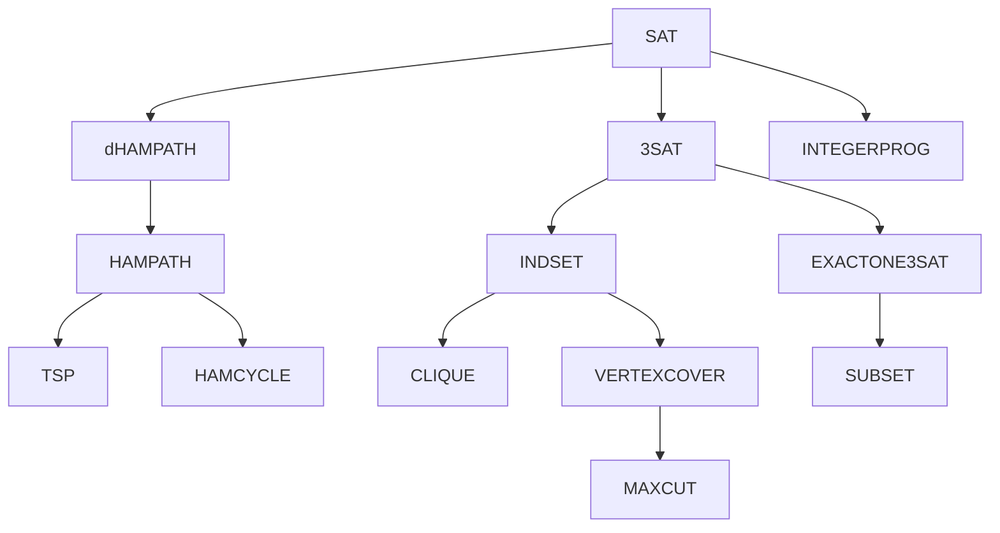
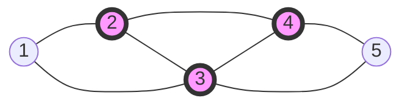
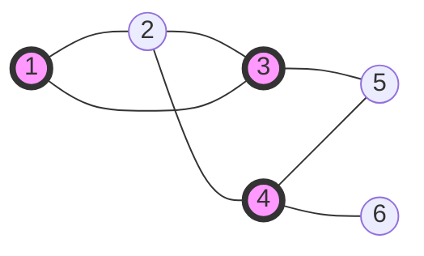
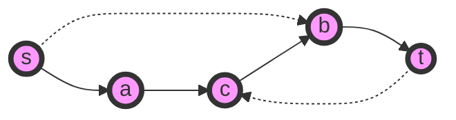
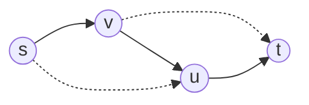
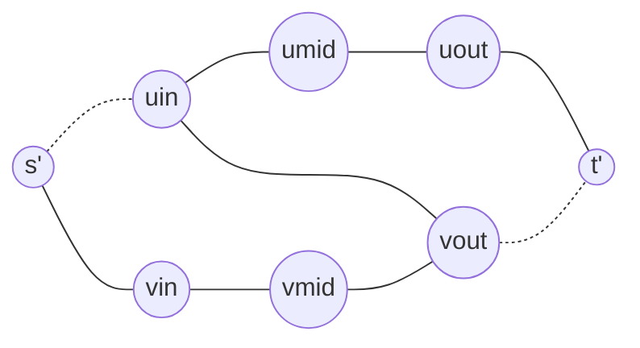

## Last class

- **Cook-Levin Theorem**:$SAT$ is $NP$-$complete$.
  - $NP$-$complete=NP$ $\cap$ $NP$-$hard$
  - L is $NP$-$hard$ if and only if $\forall K\in NP,K\leq_P L$.
- **Karp Reduction**(Poly-time many-one reduction)
  - $L\leq_PK$ if $\exist$ poly-time TM $M$ s.t. $(\forall x)(x\in L\Harr M(x)\in K)$​.
- **Cook Reduction**(Poly-time Turing reduction)
  - $L$ is Cook-reducible to $K$ if $\exist$ an oracle TM with oracle access to $K$ that decides $L$​ in polynomial time.
- $SAT$ is $NP$-$complete$ under Karp reduction. So, $SAT$ is also $NP$-$complete$ under Cook reduction.
- $L$ is $NP$-$hard$ under Karp reduction $\Harr$ $L$ is $NP$-$hard$​ under Cook reduction.
  - $\Rightarrow$:Obvious
  - $\Leftarrow$:???
- $SAT\leq_P3SAT$
- $SAT\leq_P INTEGERPROG\leq_P01PROG$

***

- $INDSET=\{\langle G,k\rangle |G\ has\ an\ independent\ set\ of\ size\ k\}$

*Thm 5.32* $3SAT\leq_PINDSET$

*Proof:* $3CNF\ \varphi$ with $m$ clauses $\rightarrow$ $G$ with $7m$ vertices.

$\varphi$ is satisfiable $\Harr$ $\langle G,m\rangle \in INDSET$.

For each clause, make a cluster, consisting of $7$ vertices (satisfying assignments). Connect all.

eg. $C_1=x_1\vee \bar{x_2}\vee x_3$	$(x_1,x_2,x_3)\neq (0,1,0)$​

For different clauses, connect the assignments if they are inconsistent.

$\Rightarrow$: For each clause, take the vertex in the cluster that corresponds to the satisfying assignment.

$\Leftarrow$: Observe that if there exists an independent set of size $m$, then the set has exactly one vertex from each cluster. Since there is no edge between any pair, the assignment must be consistent.

*Q.E.D.*

***

- $CLIQUE=\{\langle G,k\rangle|G\ has\ a\ K_k\ subgraph\}$

eg. Consider graph $G$ below. $\langle G,3\rangle\in CLIQUE,\langle G,4\rangle\notin CLIQUE$.

*Thm 5.33* **$CLIQUE$ is NP-complete.**

*Proof:* $INDSET\leq_PCLIQUE$

Given a certificate $w=\{v_1,...,v_k\}$, verifying $\langle G,k\rangle \in CLIQUE$ is in $P$.

***

- $VERTEXCOVER=\{\langle G,k\rangle|G\ has\ a\ vertex\ cover\ of\ size\ k\}$

eg. Consider graph $G$ below. $\langle G,3\rangle \in VERTEXCOVER$.

- A **vertex cover** of a graph is a set of vertices that includes at least one endpoint of every edge of the graph.

*Thm 5.34* **$VERTEXCOVER$ is NP-complete.**

*Proof:* 

1. We prove $VERTEXCOVER$ is in $NP$.
2. We prove $INDSET\leq_PVERTEXCOVER$.

$\langle G,k\rangle \in VERTEXCOVER\Harr \langle G,|V(G)|-k\rangle\in INDSET$.

Because $C\subseteq V(G)$ is a vertex cover if and only if $V(G)\setminus C$ is an independent set. *Q.E.D.*

***

- $dHAMPATH=\{\langle G,s,t\rangle|Directed\ graph\ G\ has\ a\ Hamilton\ path\ from\ s\ to\ t\}$​

eg. Consider graph $G$ below. $\langle G,s,t\rangle\in dHAMPATH$.

*Thm 5.35* **$dHAMPATH$ is NP-complete.**

*Proof:* We claim $dHAMPATH\in NP$. We show $3SAT\leq_PdHAMPATH$.

For any $3CNF\ \phi$, construct a directed graph $G$ with two vertices $s$ and $t$ s.t. an $s$-$t$ Hamilton path exists $\Harr\phi$​ is satisfiable.

Suppose $\phi=(a_1\vee b_1\vee c_1)\wedge...\wedge(a_k\vee b_k\vee c_k)$, where $a_i,b_i,c_i\in\{x_1,\bar{x_1},...,x_l,\bar{x_l}\}$.

Represent each $x_i$ with a diamond-shaped structure, that can be traversed in either of the two ways, corresponding to two truth settings. Each diamond structure contains a horizontal row, that contains $3k+1$​ vertices (in addition to the two nodes on the end).

eg. $k=2$ case:

We claim $\phi$ is satisfiable if and only if $G$ has an $s$-$t$ Hamilton path. *Q.E.D.*

***

- $HAMPATH=\{\langle G,s,t\rangle|Undirected\ graph\ G\ has\ a\ Hamilton\ path\ from\ s\ to\ t\}$

*Thm 5.36* **$HAMPATH$ is NP-complete.**

*Proof:* $HAMPATH\in NP$

Let us prove $dHAMPATH\leq_PHAMPATH$.

Given a directed graph $G$, and $s,t\in V(G)$, construct an undirected graph $G'$, $s',t'\in V(G')$ s.t. $G$ has an $s$-$t$ Hamilton path if and only if $G'$ has an $s'$-$t'$ Hamilton path.

eg. Consider $G$:

Construct $G'$:

Each vertex $u\in V(G)\setminus \{s,t\}$ is replaced by a triple $u^{in},u^{mid},u^{out}$ in $G'$. Replace $s$ by $s'$, $t$ by $t'$. Connect $u^{mid}$ with $u^{in}$ and $u^{out}$.

If $(u,v)\in E(G)$, then connect $u^{out}$ with $v^{in}$.

Claim: $G$ has an $s$-$t$ Hamilton path if and only if $G'$ has an $s'$-$t'$ Hamilton path. *Q.E.D.*

***

## Time Hierarchy Theorem

- Question: Is $DTIME(n)\subsetneqq DTIME(n^2)$ ? Is $P\subsetneqq EXP$​ ?