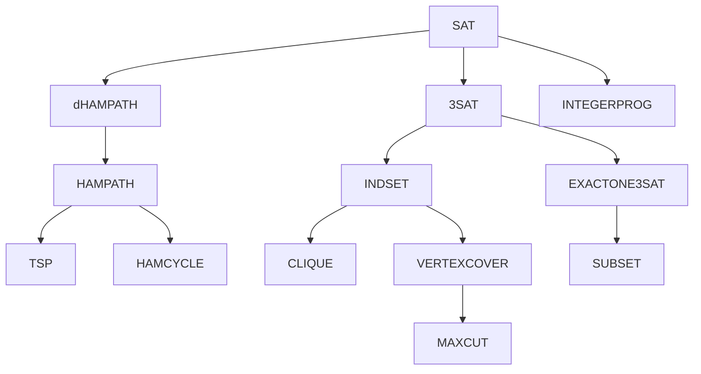

## Last class

- NP-complete problems: $NP$-$complete=NP\cap NP$-$hard$​
  - eg. $SAT$, $3SAT$, $01PROG$, $INTEGERPROG$, $CLIQUE$, $VERTEXCOVER$, $INDSET$, $dHAMPATH$, $HAMPATH$, $MAXCUT$​...

## Time Hierarchy Theorem

- Question: Is $DTIME(n)\subsetneqq DTIME(n^2)$ ? Is $P\subsetneqq EXP$​​ ?

*Def 5.37* **(Time-constructible)** Function $T:\mathbb{N}\rightarrow \mathbb{N}$ is time-constructible if $T(n)\geq n$ and there is a TM $M$ that computes the function $1^n\rightarrow T(n)$ (in binary) in time $O(T(n))$​.

eg. $n$, $n^2$, $n^3$, $n\lfloor \log_2n\rfloor$, $2^n$, $2^{n^2}$​... are time-constructible.

*Def 5.38* **(Time Hierarchy Theorem)** If $f,g$ are time-constructible functions satisfying $f(n)\log f(n)=o(g(n))$, then
$$
DTIME(f(n))\subsetneqq DTIME(g(n))
$$
eg. $DTIME(n)\subsetneqq DTIME(n^2)\subsetneqq DTIME(n^3)$, $P\subsetneqq EXP$, $DTIME(n^2)\subsetneqq DTIME(n^{2.1})$, $DTIME(n^2)\subsetneqq DTIME(n^2\log^2n)$ (since $n^2\log(n^2)=o(n^2\log^2n)$​)

*Proof:* Diagonalization

Construct $L$ s.t. $L\in DTIME(g(n))$ and $L\notin DTIME(f(n))$.

| \            | $M_0$ | $M_1$ | $M_2$ | $M_3$ | $M_4$ | ...  |
| ------------ | ----- | ----- | ----- | ----- | ----- | ---- |
| $\epsilon=0$ | $R$   | $A$   | $R$   |       |       |      |
| $0=1$        | $R$   | $A$   | $L$   |       |       |      |
| $1=2$        | $R$   | $R$   |       |       |       |      |
| $00=3$       | $R$   |       |       |       |       |      |
| $01=4$       | $R$   |       |       |       |       |      |
| ...          |       |       |       |       |       |      |

($A$: accept	$R$: reject	$L$: loop forever)

Simulate $\frac{g(n)}{\log g(n)}$ steps.

Flip the output:
$$
\left\{ \begin{array}{ll}A\rightarrow R\\R\rightarrow A\\L\rightarrow R\\ \end{array}\right.
$$
Claim: $\frac{g(n)}{\log g(n)}=\omega f(n)$

Proof of the claim: 

- Case 1: $g(n)\geq f(n)^2$

$$
\frac{g(n)}{\log g(n)} \geq \frac{g(n)}{g(n)^{\frac{1}{3}}}=g(n)^{\frac{2}{3}}\geq f(n)^{\frac{4}{3}}=\omega(f(n))
$$

- Case 2: $g(n)<f(n)^2$

$$
\frac{g(n)}{\log g(n)}\geq \frac{g(n)}{2\log f(n)}=\omega(f(n))
$$

Since $f(n),g(n)$ are time-constructible, we can construct $\lfloor \frac{g(n)}{\lfloor\log_2g(n)\rfloor}\rfloor$ in time $O(g(n))$​. 

Construct the following TM:

On input $x\in \{0,1\}^n$, simulate $M_x$ on input $x$ for $t(n)$ steps, and flip the output, i.e. 

​	(1) If $M_x$ accepts $x$ in $t(n)$ steps, reject.

​	(2) If $M_x$ rejects $x$ in $t(n)$ steps, accept.

​	(3) If $M_x$ does not halt in $t(n)$​ steps, reject.

Let $L=L(M)$.

The simulation takes $O(t(n)\cdot \log t(n))=O(\frac{g(n)}{\log g(n)}\log \frac{g(n)}{\log g(n)})=O(g(n))$.

So, $L\in DTIME(g(n))$.

Claim: $L\notin DTIME(f(n))$

Assume for contradiction that $L$ is decidable by some TM $M_\alpha$ in time $O(f(n))$​.

On input $\alpha$, $M_\alpha$ accepts or rejects $\alpha$. By the definition of $L$, if $M_\alpha$ accepts $\alpha$, then $\alpha \notin L$, contradiction. If $M_\alpha$ rejects $\alpha$, then $\alpha \in L$, contradiction. *Q.E.D.*

***

## NP-immediate Problems

*Thm 5.39* **(Ladner 1975)** Suppose $P\neq NP$. There exists $L\in NP\setminus P$ that is not $NP$-$complete$.

*Proof idea:* **Padding**
$$
SAT_H=\{\phi 01^{mH(m)}|\phi\in SAT,m=|\phi|\}
$$
Open problem: prove *Graph Isomorphism*, *Factoring* are $NP$-$immediate$, assuming $P\neq NP$.

***

- **Computational Complexity Theory** focuses on classifying problems according to their resource usage, and relating these classes to each other.
- Resources: time, space, randomness, parallism, ...

***

*Def 5.40* **(Space complexity)** TM $M$ runs in space $S(n)$ if for every input $x\in \{0,1\}^*$, it uses at most $S(|x|)$ cells on its work tapes (excluding the read-only tapes)

*Def 5.41* ($SPACE(S(n))$) Let $S:\mathbb{N}\rightarrow \mathbb{N}$. $L\subseteq\{0,1\}^*$ is in $SPACE(S(n))$ if there exists a TM that decides $L$ in space $O(S(n))$.

eg. $SAT=\{\langle\phi\rangle|\phi\ has\ a\ satisfiable\ assignment\}$. $SAT\in NP$-$complete$.

$SAT\in DTIME(2^n),SAT\in SPACE(n)$

Construct the following TM $M$:

On input $\phi$, where $\phi$ is a boolean formula. For every assignment $\rho:\{x_1,...,x_n\}\rightarrow \{0,1\}$, check if $f|_\rho$ is true. Accept if there exists a $\rho$ s.t. $f|_\rho$ is true. Otherwise, rejects.

$M$ decides $SAT$ in time $O(2^n)$ in space $O(n)$.

***

*Def 5.42* Let $S:\mathbb{N}\rightarrow \mathbb{N}$. $L\subseteq\{0,1\}^*$ is in $NSPACE(S(n))$ if there exists an NTM that runs in space $O(S(n))$ and decides $L$.

***

*Thm 5.43*
$$
DTIME(S(n))\subseteq SPACE(S(n))\subseteq NSPACE(S(n))\subseteq DTIME(2^{O(S(n))})
$$
*Proof:* 

(1) $DTIME(S(n))\subseteq SPACE(S(n))$

Let $L\in DTIME(S(n))$. Then $L$ is decidable by a TM $M$ that runs in time $O(S(n))$. So, $M$ uses at most $O(S(n))$ space. Thus, $L\in SPACE(S(n))$.

(2) $SPACE(S(n))\subseteq NSPACE(S(n))$

A DTM is also an NTM.

(3) $NSPACE(S(n))\subseteq DTIME(2^{O(S(n))})$	Idea: Configuration graph

Input tape (read-only)	Work tapes: 1~m

- Bits to encode a configuration: 

$$
{{\lceil \log_2n\rceil}\atop{\scriptstyle\text{(head position on the input tape)}}}+{m\lceil\log_2O(S(n))\rceil\atop{\scriptstyle\text{(heads on m work tapes)}}}+{O(S(n))\cdot \lceil\log_2|\Gamma|\rceil\atop{\scriptstyle\text{(symbols on all work tapes)}}}+{\lceil \log_2|Q|\rceil\atop{\scriptstyle\text{(states)}}}\\=O_M(S(n))\ (\text{Assuming }S(n)\geq \log_2n)
$$

Let $G_{M,x}$ be the configuration graph for NTM $M$ and input $x$​​. ($\delta:Q\times \Gamma\rightarrow P(Q\times\Gamma\times\{L,R,S\}^m)$)

$|V(G_{M,x})|\leq 2^{O_M(S(n))}$, because each vertex can be encoded by $O_M(S(n))$ bits.

$|E(G_{M,x})|\leq |V(G_{M,x})|\times {maxdeg\atop{\scriptstyle{(=O_M(1))}}}=2^{O_M(S(n))}\times O_M(1)=2^{O_M(S(n))}$

$G_{M,x}$ has a start configuration $c_{start}$ and many accept configurations.

Use BFS to check if $c_{start}$ is connected to an accept configuration.

The time complexity of BFS is $O(|V|+|E|)=2^{O_M(S(n))}$​. *Q.E.D.* 

***

*Def 5.44* **(Space-constructible functions)** Function $S:\mathbb{N}\rightarrow \mathbb{N}$ is space-constructible if there exists a TM s.t. on input $1^n$, output the binary representation of $S(n)$ in space $O(S(n))$.

*Thm 5.45* **(Space Hierarchy Theorem)** Let $f,g$ be space-constructible functions satisfying $f(n)=o(g(n))$. Then $SPACE(f(n))\subsetneqq SPACE(g(n))$.

*Proof idea:* Diagonalization

